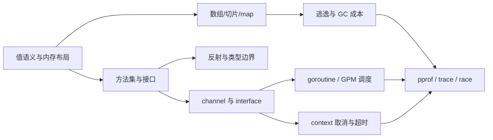

# Go 程序员面试笔试宝典：高效复习目录

> 这不是原站逐页摘要，而是把原材料压缩成一条可反复回忆的主干：**值与内存 → 数据结构 → 接口抽象 → 并发协作 → 运行时 → 性能诊断**。

## 一、这套笔记怎么用

- ⭐ **必须掌握**：项目高频、后续知识依赖、面试常问；要求能解释、能写出、能判断场景。
- △ **理解即可**：用于建立因果链，遇到问题能定位方向，不要求背源码字段。
- ○ **知道存在**：实现细节或低频技巧，需要时再查，不进入日常主干复习。

每篇最后都有“核心问答”和“自测与答案”。复习时先遮住答案，用口头或纸笔完成三件事：

1. 解释它是什么、为什么这样设计；
2. 写出最小正确代码；
3. 面对真实项目，判断该用什么、不能用什么。

## 二、核心主干

## 三、推荐学习顺序

### 第一轮：先形成能写项目的最小闭环

1. [切片与 map：数据容器的行为边界](./01-切片与map-数据容器.md)
2. [接口、方法集与反射：抽象与动态类型](./02-接口方法集与反射.md)
3. [channel 与并发：协作、同步、退出](./03-channel与并发闭环.md)
4. [context：请求级取消与超时](./04-context与并发工程.md)

这一轮的验收标准：能写一个**带超时、可取消、不会泄漏 goroutine 的 worker pipeline**。

### 第二轮：理解“为什么会这样”

5. [编译器、逃逸与工具链](./05-编译逃逸与工具链.md)
6. [GPM 调度器：goroutine 为什么轻量但不免费](./06-GPM调度器.md)
7. [GC、内存与性能诊断](./07-GC内存与性能.md)

这一轮的验收标准：面对延迟、内存、goroutine 数量异常，能提出**可验证的假设**，而不是凭印象改参数。

### 第三轮：最后再看高风险边界

8. [unsafe：只在边界处使用](./08-unsafe深水区.md)
9. [跨章节综合问答与复习卡](./09-跨章节综合问答.md)

## 四、原材料重组说明

| 原材料章节 | 在本笔记中的位置 | 压缩策略 |
|---|---|---|
| 数组与切片 | 01 | 保留 header、共享底层数组、append 与函数参数；删去版本绑定的扩容数字 |
| 哈希表 | 01 | 保留 API 行为、key 约束、无序、并发边界；实现部分改为“版本敏感” |
| 接口 | 02 | 以方法集、动态类型/值、nil 陷阱、断言为主线 |
| channel | 03 | 以状态矩阵、关闭协议、happens-before、泄漏为主线 |
| context / reflect / unsafe | 02、04、08 | 分离常用工程写法与低频底层技巧 |
| 编译 | 05 | 迁移到 Go Modules、现代 go 命令和可验证的逃逸分析 |
| 调度器 | 06 | 只记 G/M/P、队列、阻塞、抢占、work stealing 的因果链 |
| GC | 07 | 以对象可达性、并发标记清扫、GOGC/GOMEMLIMIT、诊断闭环为主 |

## 五、版本边界

- 代码按 **Go Modules + Go 1.22 及以上**的常用语义书写。
- Go 1.22 起，使用 `:=` 声明的 range 变量按迭代生成；旧资料中“闭包统一捕获最后一个值”的经典陷阱不应直接套到新模块。
- Go 1.24 起，内置 map 的运行时实现改为基于 Swiss Tables；因此旧资料中的 `hmap/bmap/overflow` 只能作为历史实现理解，不能当作当前源码契约。
- 运行时内部结构、扩容系数、调度细节都可能变化。项目代码依赖语言规范、标准库文档和工具实测，而不是依赖某个版本的字段布局。

## 六、总复习检查表

- [ ] 我能解释 slice 为什么是值传递，却能修改底层元素。
- [ ] 我能解释 `nil interface` 与“动态类型为指针、动态值为 nil”的区别。
- [ ] 我能写出安全的 channel 关闭和 goroutine 退出协议。
- [ ] 我能说明 context 是取消/截止时间树，而不是参数垃圾桶。
- [ ] 我能用 `go test -race`、benchmark、pprof、trace 验证性能判断。
- [ ] 我能说明一次对象从栈/堆、GC 根、并发调度到最终回收的大致链路。

## 七、来源

- 原始材料：[Go 程序员面试笔试宝典](https://golang.design/go-questions/)
- 当前工具链：[Go Release History](https://go.dev/doc/devel/release)
- 语义边界：[Go Specification](https://go.dev/ref/spec)
