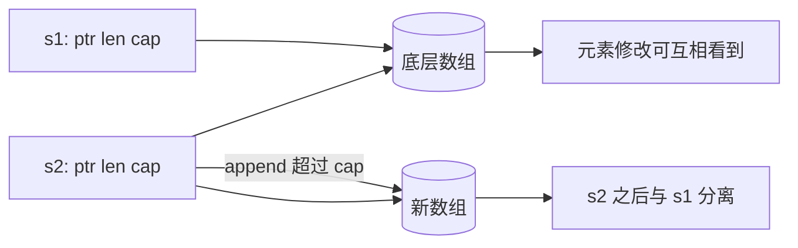

# 切片与 map：Go 中最常用的数据容器

> 记忆主线：**数组提供连续存储，slice 提供可变视图，map 提供按 key 查找；三者都不是“自动并发安全”。**

## 一、是什么

### 1. Slice ⭐

slice 是对底层数组的一段描述，概念上包含：底层数据指针、`len`、`cap`。它本身是一个小的值，不是数组本体。

### 2. Map ⭐

map 是 key-value 字典：一个 key 至多对应一个 value，核心操作是查、增、改、删。它的内部实现属于运行时细节，API 只承诺语言规范规定的行为。

## 二、为什么需要

- 数组长度是类型的一部分，`[3]int` 和 `[4]int` 是不同类型，适合固定大小、值语义明确的数据。
- slice 适合列表、批量结果、缓冲区；map 适合按 ID、名称或组合 key 查找对象。
- 如果混淆“容器头”和“底层存储”，就会出现 append 后数据不见、意外覆盖、内存长期保留、并发 panic 等问题。

## 三、核心用法

### 1. Slice：永远接住 append 的返回值 ⭐

```go
items := make([]string, 0, 16) // len=0, cap=16
items = append(items, "a", "b")
items = append(items, more...)

fmt.Println(len(items), cap(items), items)
```

`append` 的输入输出形状：`[]T + ...T -> []T`。它可能复用原数组，也可能分配新数组；调用方必须使用返回的新 slice header。

### 2. Slice：区分“改元素”和“改 slice 头” ⭐

```go
func normalize(xs []int) []int {
	for i := range xs { // i 是索引，不是元素副本
		xs[i]++
	}
	return append(xs, 100) // 可能改变底层数组，也可能换数组
}
```

- `xs[i] = ...`：在共享底层数组时，调用方能看到元素修改。
- `xs = append(xs, ...)`：只改变函数内部的 slice 头；若要让调用方看到长度变化，返回并重新赋值。
- 函数参数传递始终是值传递，slice 只是被复制了 header。

### 3. 用 full slice expression 控制容量 ⭐

```go
view := data[2:5:5] // len=3, cap=3
view = append(view, x) // 必然分配新数组，不覆盖 data[5] 之后的空间
```

`a[i:j:k]` 的结果是 `len=j-i`、`cap=k-i`。当把子 slice 交给不应改写后续空间的代码时，用它隔离 append 的影响。

### 4. 需要独立副本时显式复制 ⭐

```go
clone := slices.Clone(data) // Go 1.21+
```

如果只是 `clone := data`，仍然共享底层数组。长生命周期对象只保留大数组的一小段时，应考虑 `slices.Clone`，避免小 slice 把大数组一直挂住。

### 5. Map 的查找、删除与初始化 ⭐

```go
m := make(map[string]int, 32)
m["alice"]++

v, ok := m["bob"] // ok 区分“缺失”和“值恰好是零值”
delete(m, "alice") // key 不存在也安全

for k, v := range m { // 顺序不作任何保证
	_ = k
	_ = v
}
```

Map 状态：

| 操作 | nil map | 已初始化、未关闭概念 |
|---|---|---|
| 读取 | 返回 value 零值 | 返回值或零值 |
| `len` / `range` | 安全 | 安全 |
| `delete` | 安全 | 安全 |
| 写入 | panic | 正常 |

### 6. Map 的 key 约束 ⭐

key 必须可比较：整数、字符串、指针、数组、只含可比较字段的 struct、接口（动态值也必须可比较）等；slice、map、func 不能直接作为 key。

### 7. 并发访问的项目写法 ⭐

```go
type Cache struct {
	mu sync.RWMutex
	m  map[string]Item
}

func (c *Cache) Get(k string) (Item, bool) {
	c.mu.RLock()
	defer c.mu.RUnlock()
	v, ok := c.m[k]
	return v, ok
}
```

写多读少、生命周期复杂或 key/value 类型固定时，优先用普通 map + 明确的锁；`sync.Map` 只在其适合的读多写少、key 生命周期特殊等场景中使用，不能把它当作“更快的 map”。

## 四、核心原理

### 1. Slice 的共享与分离



扩容策略和容量数值不是语言契约。稳定的因果关系只有：容量不足时可能分配新数组并复制元素，容量足够时可能复用原数组。

### 2. Map 的哈希查找 △

抽象流程是：`hash(key) → 定位候选区域 → 比较 key → 读写 value`。冲突、增长、迁移等由 runtime 负责。旧材料以 bucket/overflow 解释原理很有价值，但 Go 1.24 起默认实现基于 Swiss Tables，不能再背旧版 `hmap` 字段或装载因子数字。

### 3. 复杂度的正确表述 △

map 的查找在正常分布下通常接近 `O(1)`，但不是数学上无条件的 `O(1)`；极端碰撞、缓存行为、扩容和 GC 都会影响实际延迟。性能判断用 benchmark 和 profile 验证。

## 五、常见场景

- ⭐ API 返回列表：用 `[]T`，若不希望调用方修改内部数据，返回副本或只读约定。
- ⭐ 按 ID 查实体：用 `map[ID]T` 或 `map[ID]*T`；选择值还是指针要看复制成本和共享变更语义。
- ⭐ 批量拼接：能预估数量就 `make([]T, 0, n)`；不能预估也不要手写扩容公式。
- △ 需要有序输出：先收集 key，再 `slices.Sort`；不要依赖 map range 顺序。
- ○ 运行时 map 内部：只有排查版本相关性能问题或阅读 runtime 时再深入。

## 六、踩坑点

1. **`append` 不接返回值**：编译器会拒绝；接住但不赋回外层 slice 也可能看不到长度变化。
2. **range 元素是副本**：`for _, v := range xs { v++ }` 不会改 slice；用索引写回。
3. **子 slice 留住大数组**：小结果长期存活时用 `slices.Clone`。
4. **map 缺失不等于 value 为零**：需要判断 `ok`。
5. **nil map 写入 panic**：结构体构造、反序列化、并发初始化时尤其常见。
6. **map range 无序**：测试、日志、序列化若需要稳定结果，显式排序。
7. **不能取 map 元素地址**：元素可能因增长而移动；先取出副本或存指针。
8. **并发读写不是安全的**：读写冲突可能直接 fatal；多写也不安全。加锁、单 goroutine 所有权或使用合适的并发容器。
9. **range 闭包旧陷阱要看 go.mod**：Go 1.22+ 的新语义按迭代创建变量；维护旧模块时仍应看模块版本和实际编译语义。

## 七、项目中的实际使用

一个分页查询通常是：

```go
func ListUsers(ctx context.Context, repo Repository, page, size int) ([]User, error) {
	if size <= 0 || size > 100 {
		return nil, fmt.Errorf("invalid page size: %d", size)
	}
	users, err := repo.List(ctx, page, size)
	if err != nil {
		return nil, err
	}
	return users, nil
}
```

推荐原则：

- 返回 `nil, err` 表示失败；成功但无数据可返回空 slice 或 nil slice，团队内统一约定。
- 对外暴露内部缓存的 slice/map 时，明确是否允许修改；不允许就复制。
- 需要并发读写的 map，把锁和 map 放在同一个类型内，不把锁的责任散落给调用方。
- 不为“可能更快”提前使用 unsafe 访问容器内部；容器实现会变。

## 八、一句话总结

**slice 是可共享、可分离的数组视图；map 是无序的哈希字典；先分清值、底层存储和并发所有权，再谈性能。**

## 九、核心问答

### Q1：slice 作为参数是引用传递吗？

不是。Go 只有值传递；复制的是 slice header，所以元素数组可能共享，但 `len/cap/ptr` 的重新赋值只影响参数副本。

### Q2：为什么 `append` 后有时会影响另一个 slice？

因为 append 可能复用共享底层数组；如果容量不足，可能分配新数组，之后两个 slice 分离。

### Q3：为什么 map 缺失时能返回零值？

语言把缺失 key 的单值读取定义为对应 value 类型的零值；需要区分缺失与零值时使用 `v, ok := m[k]`。

### Q4：map 为什么不能并发写？

map 的内部状态会被更新，语言/runtime 不提供并发写的同步保证；并发读写可能 fatal，解决方案是锁、所有权隔离或专门容器。

### Q5：要不要记住 slice 扩容的具体公式？

不用。记住“容量不足会重新分配并复制”即可；具体容量还受元素大小和内存分配对齐影响，且实现会变。

## 十、自测与答案

### 题目

1. `s := make([]int, 3, 3)` 传给函数后，函数执行 `s = append(s, 4)`，调用方的 `len(s)` 会变吗？为什么？
2. 如何让一个子 slice 的 append 不覆盖原 slice 的后续元素？
3. nil map 的读取、删除、写入分别是什么结果？
4. 为什么 map 的遍历结果不能用于生成稳定签名？
5. 设计一个并发安全的缓存，普通 map、`sync.Map`、channel 所有权模型如何选？

<details>
<summary>答案</summary>

1. 不会。append 产生的新 header 只赋给函数参数；调用方需要接收返回值。底层数组是否复用不改变这一结论。
2. 使用 `s[i:j:j]` 限制 cap，或复制出独立 slice。
3. 读返回零值，删除安全，写入 panic。
4. map range 顺序不作保证，运行时可能随机化；先取 key 并排序。
5. 固定类型且需要明确一致性时普通 map + `sync.RWMutex`；适合特定读多写少模型时考虑 `sync.Map`；单 goroutine 独占状态时可用 channel/消息传递。

</details>

## 参考

- [原材料：数组与切片](https://golang.design/go-questions/slice/)
- [原材料：哈希表](https://golang.design/go-questions/map/)
- [Go 1.24：Swiss Tables map](https://go.dev/blog/swisstable)
- [Go Specification：Map types](https://go.dev/ref/spec#Map_types)
