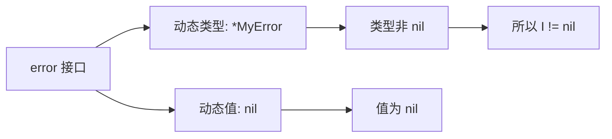

# 接口、方法集与反射：把类型边界讲清楚

> 记忆主线：**接口约束行为，方法集决定能否实现，动态类型/值决定运行时装的是什么；反射只是把这套类型信息延迟到运行时。**

## 一、是什么

接口是一组方法的行为契约。Go 不要求显式声明“实现了接口”，只要方法集满足接口即可。

反射是运行时查看、构造或修改类型和值的机制，常见入口是 `reflect.TypeOf` 和 `reflect.ValueOf`。

## 二、为什么需要

- 接口让调用方依赖行为而不是具体实现，便于替换、测试和组合。
- 方法集规则解决“值接收者/指针接收者到底谁实现了接口”的问题。
- 反射服务于框架、序列化、ORM、依赖注入等“编译时不知道具体类型”的边界；业务主路径优先静态类型。

## 三、核心用法

### 1. 小接口 + 隐式实现 ⭐

```go
type Reader interface {
	Read(context.Context) ([]byte, error)
}

type FileReader struct{}

func (FileReader) Read(context.Context) ([]byte, error) {
	return nil, nil
}

var _ Reader = FileReader{} // 编译期契约检查
```

接口应由使用方定义，方法尽量少；一个接口只表达一组真正需要的行为。

### 2. 值接收者和指针接收者 ⭐

```go
type Counter struct{ n int }

func (c Counter) Value() int { return c.n } // T 和 *T 都有
func (c *Counter) Inc()       { c.n++ }     // 只有 *T 的方法集有
```

| 类型 | 方法集 |
|---|---|
| `T` | 值接收者方法 |
| `*T` | 值接收者 + 指针接收者方法 |

编译器允许对**可寻址的值**自动取地址调用指针方法，例如 `c.Inc()`；但把 `T` 赋给接口时不会凭空把它变成 `*T`。

### 3. 类型转换、类型断言、类型 switch ⭐

```go
var x any = int64(3)

n, ok := x.(int64) // 断言：只对接口值做；失败不 panic
_ = n
_ = ok

switch v := x.(type) {
case int64:
	fmt.Println(v)
case string:
	fmt.Println(v)
}
```

`int64(i)` 是类型转换；`x.(int64)` 是从接口动态值做类型断言。不要混为一谈。

### 4. 修复 typed nil ⭐

```go
type MyError struct{}

func (*MyError) Error() string { return "my error" }

func f() error {
	var e *MyError
	return e // error 非 nil：动态类型是 *MyError，动态值是 nil
}
```

推荐在返回 error 前直接返回 `nil`，或确保错误对象确实存在，不要把 nil 指针包装进接口。

### 5. 反射的最小安全模板 △

```go
func setString(ptr any, s string) error {
	v := reflect.ValueOf(ptr)
	if v.Kind() != reflect.Pointer || v.IsNil() {
		return errors.New("need non-nil pointer")
	}
	e := v.Elem()
	if e.Kind() != reflect.String || !e.CanSet() {
		return errors.New("need settable string")
	}
	e.SetString(s)
	return nil
}
```

反射写入的因果链：`ValueOf(&x) → Elem() → CanSet() → Set...`。直接 `ValueOf(x).Set...` 修改不了原变量，通常会 panic。

### 6. 相等比较的选择 ⭐

- 可比较类型：优先 `==`。
- slice：使用 `slices.Equal`；map：使用 `maps.Equal`（Go 1.21+）。
- 需要递归比较且接受其语义：`reflect.DeepEqual`；不要把它当成所有业务对象的“正确相等”。

## 四、核心原理

### 1. 接口值的两部分

接口值可以用概念模型表示为：

```text
接口值 = (动态类型, 动态值)
```



非空接口还需要方法分派信息；空接口 `any` 只需记录具体类型和值。具体 runtime 字段名会变，`动态类型 + 动态值` 是稳定的解释模型。

### 2. 方法集是接口实现的判定依据

若接口要求方法集合 `M`，类型的 method set 完整包含 `M`，才实现接口。指针接收者不会自动加入 `T` 的方法集，这是接口赋值报错的常见原因。

### 3. 反射三条定律 △

1. interface value → `reflect.Type` / `reflect.Value`；
2. `reflect.Value` → interface value（`Interface()`）；
3. 要修改原值，Value 必须可设置（通常要从指针 `Elem()` 得到）。

## 五、常见场景

- ⭐ handler、repository、storage、clock 等边界：用小接口做替换与测试。
- ⭐ `io.Reader` / `io.Writer` 风格的组合：按能力拆接口。
- △ 序列化、ORM、配置绑定：反射适合边界层，进入核心业务后尽量转成明确类型。
- ○ `iface/eface/itab`、接口转换缓存：用于读 runtime 或分析极端性能，不是项目编码知识。

## 六、踩坑点

1. **指针接收者导致接口赋值失败**：`T` 不一定实现接口，先检查方法集。
2. **接口 nil 陷阱**：`var p *T; var x I = p` 时 `x != nil`。
3. **无保护断言会 panic**：跨边界数据用 `v, ok := ...` 或 type switch。
4. **反射的 Kind 与 Type 不同**：多个自定义类型可能同为 `reflect.Int`，但 `Type` 不同。
5. **反射不可设置**：非地址值、未导出字段、错误的 `Elem` 链都可能导致 panic。
6. **接口不是继承**：它表达行为集合；不要把大型接口当成“基类”。
7. **反射不等于动态语言**：类型错误被延迟到运行时，代码可读性、性能和错误处理成本会上升。

## 七、项目中的实际使用

### 1. 依赖注入的推荐边界

```go
type UserStore interface {
	Find(ctx context.Context, id string) (User, error)
}

type Service struct{ store UserStore }

func NewService(store UserStore) *Service {
	return &Service{store: store}
}
```

生产代码注入数据库实现，测试代码注入内存 fake；接口只放 `Service` 真正用到的 `Find`，不要把整个数据库客户端接口复制进业务层。

### 2. 错误返回的建议

```go
func Load(ctx context.Context) error {
	if err := doLoad(ctx); err != nil {
		return fmt.Errorf("load config: %w", err)
	}
	return nil
}
```

用 `errors.Is/As` 判断包装后的错误；避免返回 typed nil error。

## 八、一句话总结

**接口看方法集，运行时看动态类型和值；反射只负责边界，核心业务尽量保持静态可验证。**

## 九、核心问答

### Q1：为什么 `*T` 能实现接口而 `T` 不能？

因为接口检查的是 method set；`*T` 包含值接收者和指针接收者方法，`T` 只包含值接收者方法。

### Q2：为什么 typed nil error 不等于 nil？

接口只有在动态类型和动态值都为 nil 时才等于 nil；包装 nil 指针后动态类型仍存在。

### Q3：类型转换和类型断言的边界是什么？

类型转换发生在两个兼容的静态类型之间；类型断言只对接口值操作，检查其动态类型。

### Q4：什么时候应该用反射？

当库/框架需要处理编译时未知的类型，例如序列化、ORM、通用注册表；业务主路径若能用泛型或接口表达，应优先静态写法。

### Q5：为什么接口应该小？

小接口更容易实现、替换和测试；大接口会扩大耦合，让一个不相关的方法变化影响所有实现者。

## 十、自测与答案

### 题目

1. `T` 有一个 `func (*T) Close() error`，`var c io.Closer = T{}` 能否编译？
2. `var p *bytes.Buffer; var r io.Reader = p` 后，`r == nil` 吗？
3. 如何安全地把 `any` 中的 `[]byte` 取出来？
4. 为什么 `reflect.ValueOf(x).SetInt(1)` 通常不行，而 `reflect.ValueOf(&x).Elem().SetInt(1)` 可以？
5. 业务层需要比较两个 map，什么时候用 `maps.Equal`，什么时候用 `reflect.DeepEqual`？

<details>
<summary>答案</summary>

1. 不能。`T` 的方法集不包含指针接收者方法；应传 `&T{}` 或改用值接收者。
2. 不等于 nil。动态类型是 `*bytes.Buffer`，动态值为 nil。
3. `b, ok := v.([]byte)`，检查 `ok` 后再使用；不要直接断言未知输入。
4. `ValueOf(x)` 拿到的是参数副本，不可设置；从指针的 `Elem` 才持有原变量地址。
5. 同类型 map 的常规内容相等用 `maps.Equal`；需要递归处理多种复合类型且接受 DeepEqual 语义时才用 `reflect.DeepEqual`。

</details>

## 参考

- [原材料：接口](https://golang.design/go-questions/interface/)
- [Go blog：The Laws of Reflection](https://go.dev/blog/laws-of-reflection)
- [Go Specification：Method sets](https://go.dev/ref/spec#Method_sets)
- [Go Specification：Interface types](https://go.dev/ref/spec#Interface_types)
