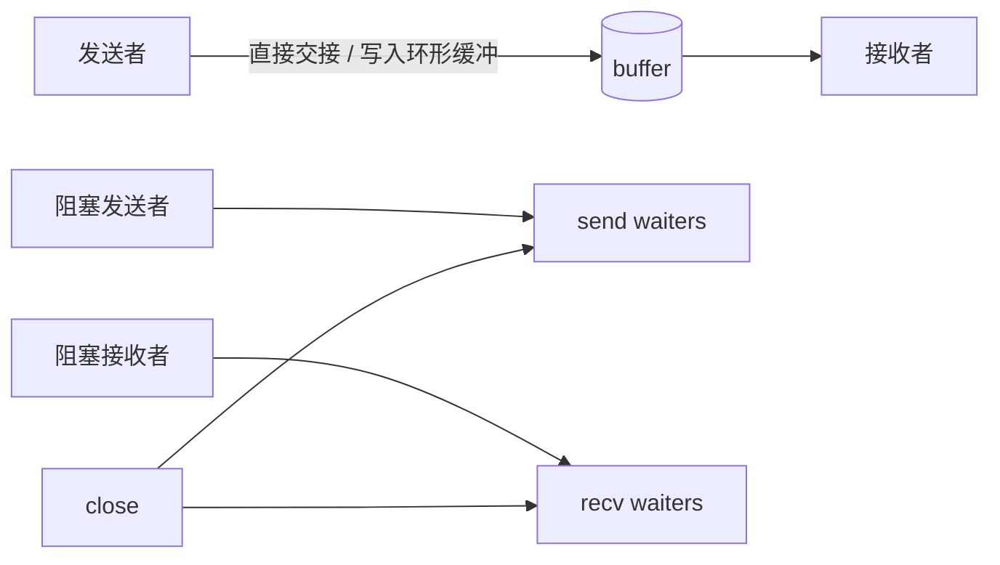

# channel 与并发：从通信到退出的最小闭环

> 记忆主线：**goroutine 执行任务，channel 传递值或信号，select 处理多个事件，关闭/取消负责收尾；并发正确性的核心是所有权和 happens-before。**

## 一、是什么

channel 是 goroutine 之间进行值传递和同步的类型。无缓冲 channel 强调同步交接，有缓冲 channel 允许有限度的生产/消费解耦。

CSP 的直觉可以记成：**不要通过共享内存来通信，而要通过通信来共享内存**。它是设计方向，不是“所有问题都必须用 channel”。

## 二、为什么需要

- 直接共享变量需要锁、原子操作和内存顺序；漏一个边界就可能产生 data race。
- channel 把“数据交接”和“等待条件”合并成一个同步点，适合流水线、事件通知、任务队列和退出信号。
- 但 channel 本身也会阻塞、泄漏、panic；复杂共享状态往往用 mutex 更直接。

## 三、核心用法

### 1. 生产者关闭，消费者 range ⭐

```go
func gen(ctx context.Context, in []int) <-chan int {
	out := make(chan int)
	go func() {
		defer close(out)
		for _, v := range in {
			select {
			case out <- v:
			case <-ctx.Done():
				return
			}
		}
	}()
	return out
}

for v := range gen(ctx, input) {
	_ = v
}
```

关闭的责任通常属于唯一知道“不会再发送”的一方；receiver 不负责关闭 data channel。

### 2. 处理关闭与零值 ⭐

```go
for {
	select {
	case v, ok := <-ch:
		if !ok {
			return // channel 已关闭且已耗尽
		}
		use(v)
	case <-ctx.Done():
		return
	}
}
```

有缓冲 channel 关闭后仍可读出已经缓冲的值；只有 `ok == false` 才表示没有更多值。

### 3. 用 channel 控制并发数 △

```go
sem := make(chan struct{}, 8)
for _, job := range jobs {
	job := job
	go func() {
		sem <- struct{}{}
		defer func() { <-sem }()
		_ = run(job)
	}()
}
```

实际项目中更推荐使用 `errgroup`、worker pool 或任务队列来同时处理错误、取消和等待；信号量只是限流原语。

### 4. select 的超时和退出 ⭐

```go
timer := time.NewTimer(200 * time.Millisecond)
defer timer.Stop()

select {
case result := <-work:
	_ = result
case <-timer.C:
	return context.DeadlineExceeded
case <-ctx.Done():
	return ctx.Err()
}
```

`select` 从就绪的 case 中选择一个；多个同时就绪时不要依赖顺序。`nil` channel 会永久阻塞，因此可以用它动态禁用某个 case。

## 四、核心原理

### 1. 三种 channel 状态矩阵 ⭐

| 操作 | nil channel | open channel | closed channel |
|---|---|---|---|
| 发送 | 永久阻塞 | 成功或阻塞 | panic |
| 接收 | 永久阻塞 | 成功或阻塞 | 读出缓冲值；耗尽后得零值、`ok=false` |
| close | panic | 正常关闭 | panic |

“永久阻塞”意味着 goroutine 可能泄漏；“panic”意味着责任协议错了，不应靠 recover 当正常流程。

### 2. channel 传递的是值的拷贝 ⭐

发送 `*User` 时，拷贝的是指针值，不是复制 `User` 对象。接收方和发送方仍可能共享同一个 `User`，若一方修改它，仍需要同步。

### 3. happens-before ⭐

对常见 channel 操作，记住这三条足够支撑项目判断：

1. 一次 send happens-before 对应 receive 完成；
2. 关闭 channel happens-before receiver 感知到关闭；
3. 无缓冲 channel 的接收完成会约束对应发送完成；有缓冲 channel 的容量决定允许“领先”的发送数量。

因此：

```go
var msg string
done := make(chan struct{})

go func() {
	msg = "ready"
	done <- struct{}{}
}()

<-done
fmt.Println(msg) // 有同步关系，能看到 ready
```

若去掉 channel 同步，这段代码就是竞态或未定义的观察顺序。

### 4. channel 结构的抽象模型 △



runtime 的 `hchan`、等待队列和直接拷贝路径是实现细节；稳定的工程结论是：发送、接收、关闭都会改变等待关系，任何一端退出都必须有对应的收尾策略。

## 五、常见场景

- ⭐ pipeline：每一阶段消费输入、生产输出，并在退出时关闭自己的输出。
- ⭐ worker pool：任务 channel + `WaitGroup/errgroup` + context。
- ⭐ 广播通知：关闭 `chan struct{}`；不要给每个 receiver 发送一个“结束值”。
- ⭐ 超时/取消：`select` 监听 `ctx.Done()`。
- △ 保护单一共享状态：用 mutex 通常比 channel 更简单。
- ○ 深入 runtime：sendq/recvq、sudog、直接栈拷贝只用于源码阅读与性能诊断。

## 六、踩坑点

1. **向 closed channel 发送会 panic**；不要用“先检查是否关闭”的函数竞态地解决，检查与发送不是原子操作。
2. **重复 close、close nil 都 panic**。
3. **receiver 提前 return，sender 仍在发送**：发送 goroutine 会永久阻塞，形成泄漏。用 context 或 done 信号。
4. **只用 `<-ch` 不检查 ok**：关闭后会不断读到零值，可能变成忙循环。
5. **range channel 不结束**：发送方忘记 close，消费者永久等待。
6. **用 `time.After` 在高频长循环里当作通用 timer**：需要复用 timer 时显式 `NewTimer/Reset`，并处理 Stop/drain 语义。
7. **channel 传指针不等于数据隔离**：底层对象仍共享。
8. **把 channel 当作万能锁**：任务流、信号流适合 channel；短临界区和共享 map 常用 mutex 更清晰。
9. **并发安全不等于业务正确**：channel 消除了某些数据竞态，但不自动保证任务只执行一次、结果不丢或顺序正确。

## 七、项目中的实际使用

### 推荐的 worker 闭环

```go
func worker(ctx context.Context, jobs <-chan Job, results chan<- Result) error {
	for {
		select {
		case <-ctx.Done():
			return ctx.Err()
		case job, ok := <-jobs:
			if !ok {
				return nil
			}
			result, err := handle(ctx, job)
			if err != nil {
				return err
			}
			select {
			case results <- result:
			case <-ctx.Done():
				return ctx.Err()
			}
		}
	}
}
```

流程约定：

1. 启动方持有 `cancel`，退出时负责取消；
2. 生产方关闭 jobs；
3. worker 读到 jobs 关闭后退出；
4. 结果 channel 由所有 worker 退出后再由协调方关闭；
5. 每个阻塞点都能被 context 打断；
6. 用 `errgroup.WithContext` 统一等待和首错取消。

## 八、一句话总结

**channel 的价值是把数据交接和同步关系写进代码，真正的闭环必须同时设计发送、接收、关闭、取消和等待。**

## 九、核心问答

### Q1：关闭 channel 后还能读到数据吗？

能。如果是有缓冲 channel，会先读完缓冲值；耗尽后返回元素零值和 `ok=false`。

### Q2：谁应该关闭 channel？

通常由唯一知道“不会再发送”的发送方关闭；多发送者时由协调者在所有发送者退出后关闭，receiver 不应贸然关闭 data channel。

### Q3：nil channel 有什么用？

它的收发都永久阻塞；在 select 中把一个 channel 变量置 nil，可以动态禁用对应 case，但必须确保不会因此遗留不可退出的 goroutine。

### Q4：channel 传的是引用吗？

不是。channel 传值的本质是拷贝；如果值本身是指针、slice、map 或接口，拷贝后仍可能共享它们指向的数据。

### Q5：什么时候 mutex 比 channel 合适？

保护一个共享 map/状态、临界区很短、调用方需要同步读写时，mutex 更直接；channel 更适合所有权转移、流水线和事件通知。

## 十、自测与答案

### 题目

1. 一个消费者只取前 3 个值就返回，生产者向无缓冲 channel 继续发送，会发生什么？如何修复？
2. `for v := range ch` 什么时候结束？
3. 为什么“先调用 IsClosed，再发送”不能解决关闭竞态？
4. 如何用关闭 `chan struct{}` 广播停止信号？
5. channel 传递 `*Config` 后，发送方修改 Config，接收方是否一定安全？

<details>
<summary>答案</summary>

1. 生产者可能永久阻塞，形成 goroutine 泄漏；消费者提前返回前应 cancel，生产者 select 监听 Done，或由协调器统一收尾。
2. 当 channel 被关闭且缓冲值已经读完时结束；仅仅没有值但未关闭会继续阻塞。
3. 检查和发送之间可能被其他 goroutine close，二者不是原子操作；应该由所有权协议避免发送到 closed channel。
4. `stop := make(chan struct{}); close(stop)`，所有 receiver 用 `<-stop` 监听；确保只有一个关闭者。
5. 不一定。传递的是指针，底层 Config 仍共享；修改和读取必须有同步或改用不可变副本。

</details>

## 参考

- [原材料：通道](https://golang.design/go-questions/channel/)
- [Go Memory Model](https://go.dev/ref/mem)
- [Go blog：Pipelines](https://go.dev/blog/pipelines)
