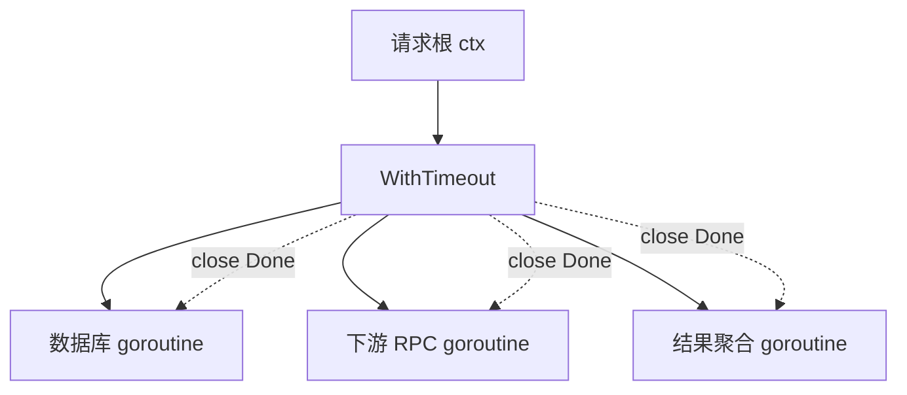

# context：请求级取消、截止时间与并发收尾

> 记忆主线：**context 是一棵只向下传播的取消/截止时间树，值只是附带的 request-scoped metadata；它不会强杀 goroutine，代码必须主动协作退出。**

## 一、是什么

`context.Context` 提供四类能力：`Done()` 取消通知、`Err()` 取消原因、`Deadline()` 截止时间、`Value()` 请求范围数据。

## 二、为什么需要

一次 HTTP/RPC 请求常常派生多个 goroutine。客户端断开、超时或上游取消后，如果下游 goroutine 继续等待数据库、RPC 或 channel，就会浪费资源，甚至形成 goroutine 泄漏和级联拥塞。

context 把这条请求链上的取消信号、deadline 和少量元数据统一起来，让每个阻塞点都能响应。

## 三、核心用法

### 1. 第一参数传递，创建后一定 cancel ⭐

```go
func Handle(parent context.Context) error {
	ctx, cancel := context.WithTimeout(parent, 800*time.Millisecond)
	defer cancel() // 释放 timer 和父子关系

	return callDownstream(ctx)
}
```

规则：

- `ctx` 通常是函数第一个参数，命名为 `ctx`；
- 不把 context 存进业务 struct；
- 不传 nil context；不确定时用 `context.TODO()`；
- `WithCancel/WithTimeout/WithDeadline` 返回的 cancel 要调用，即使最终会超时。

### 2. 每个阻塞点监听 Done ⭐

```go
func Generate(ctx context.Context, out chan<- Item) error {
	for i := 0; i < 100; i++ {
		item := build(i)
		select {
		case out <- item:
		case <-ctx.Done():
			return ctx.Err()
		}
	}
	return nil
}
```

只在循环外检查一次 `ctx.Err()` 不够：发送、接收、锁、I/O 等阻塞点仍可能卡住。

### 3. 把 context 传给标准库/下游 API ⭐

```go
req, err := http.NewRequestWithContext(ctx, http.MethodGet, url, nil)
if err != nil {
	return err
}
resp, err := http.DefaultClient.Do(req)
```

优先使用支持 context 的 API；不要只在外层设 timeout，而让下游调用继续使用 `Background()`。

### 4. request-scoped value 使用自定义 key △

```go
type requestIDKey struct{}

func WithRequestID(ctx context.Context, id string) context.Context {
	return context.WithValue(ctx, requestIDKey{}, id)
}

func RequestID(ctx context.Context) (string, bool) {
	id, ok := ctx.Value(requestIDKey{}).(string)
	return id, ok
}
```

只放跨 API、跨 goroutine 的请求元数据，例如 trace ID、认证信息；业务参数、可选配置、数据库连接不放进 context。

### 5. 需要区分取消原因时 △

现代 Go 可用 `context.WithCancelCause` / `context.Cause` 传递更具体的失败原因；普通 `ctx.Err()` 仍返回 `context.Canceled` 或 `context.DeadlineExceeded`。

## 四、核心原理

### 1. 取消是广播，不是强杀



取消函数关闭 Done channel，所有监听者都能收到；但真正 return 的责任在每个 goroutine 自己。context 不会从外部强制杀掉 goroutine。

### 2. valueCtx 是向父节点查找 △

`WithValue(parent, key, value)` 形成一个指向父 context 的节点。查找从当前节点向上，最近一次写入的同 key 会遮蔽父值；父节点无法看到子节点的值。

### 3. deadline 取最早者

子 context 的有效截止时间不会晚于父 context。若父 deadline 更早，子节点无需再创建独立 timer，只需继承父取消。

## 五、常见场景

- ⭐ HTTP/RPC 请求链路：入口从 request context 派生 timeout，所有下游复用。
- ⭐ worker/pipeline：context 负责停止生产者、消费者和结果聚合。
- ⭐ 数据库/缓存/外部 API：把 ctx 传入可取消的 I/O API。
- △ 后台任务：如果任务和请求无关，不要错误地继承请求 context；使用明确的生命周期根 context。
- ○ 自定义 Context 类型：通常没有必要，除非实现特定协议；把 ctx 包进 struct 会破坏标准传播路径。

## 六、踩坑点

1. **忘记 `cancel()`**：即使 timeout 最终到达，也可能延迟释放 timer/children。
2. **goroutine 不监听 Done**：cancel 了但 goroutine 仍卡在 channel 发送或 I/O 上。
3. **把 context 当参数袋**：值类型不清晰，依赖隐藏，容易覆盖和误用。
4. **把 context 存入 struct**：生命周期不清晰，后续调用难以替换父 context。
5. **忽略 `ctx.Err()` 的原因**：取消和超时在重试、日志和状态码上可能不同。
6. **用请求 ctx 跑异步任务**：请求结束会立即取消；异步任务要建立独立且可管理的生命周期。
7. **`select` 没有默认的退出分支**：下游无响应时，goroutine 可能一直等待。
8. **Value key 用字符串**：跨包易冲突；使用不可导出的自定义类型。

## 七、项目中的实际使用

一个服务层的标准流程：

```go
func (s *Service) Create(ctx context.Context, in Input) (Output, error) {
	if err := validate(in); err != nil {
		return Output{}, err
	}

	ctx, cancel := context.WithTimeout(ctx, 500*time.Millisecond)
	defer cancel()

	user, err := s.users.Find(ctx, in.UserID)
	if err != nil {
		return Output{}, fmt.Errorf("find user: %w", err)
	}
	return s.repo.Create(ctx, user, in)
}
```

项目验收要问：

- 上游取消后，所有下游是否都会在有限时间内退出？
- 是否把 ctx 传到了真正阻塞的数据库/RPC 调用？
- 是否会因 ctx cancel 导致正常业务错误被误记为系统故障？
- 是否有一条明确的 goroutine 等待路径，例如 `errgroup.Wait()`？

## 八、一句话总结

**context 只发出取消建议，代码必须在每个阻塞点主动响应，并用清晰的生命周期管理 goroutine。**

## 九、核心问答

### Q1：context 能直接终止 goroutine 吗？

不能。它只关闭 Done 并传播原因；goroutine 必须在 select、I/O 或循环中主动 return。

### Q2：为什么 cancel 要 defer？

确保所有返回路径都释放 timer、子节点和相关资源，重复 cancel 安全。

### Q3：context.Value 适合放什么？

请求范围、跨 API 传播的元数据；不适合可选业务参数、依赖对象和配置。

### Q4：父 ctx 已有更早 deadline，子 ctx 设置更晚会怎样？

子 ctx 会继承更早的父 deadline，后设置的时间不会延长父生命周期。

### Q5：如何判断 goroutine 泄漏风险？

逐个检查它的阻塞点：channel 收发、锁、I/O、timer 是否有 Done/超时/关闭路径；再用 goroutine profile 或 trace 验证。

## 十、自测与答案

### 题目

1. 为什么 `ctx.Err()` 检查不能只写在循环开头？
2. 写一个不会因消费者提前退出而卡住的生产者。
3. 请求 handler 启动一个异步任务，直接把 `r.Context()` 传进去是否总是正确？
4. `WithTimeout` 返回的 cancel 不调用，等超时自动取消可以吗？
5. context value 的 key 为什么不推荐 string？

<details>
<summary>答案</summary>

1. 循环体内的发送、接收、I/O 可能永久阻塞，无法回到下一轮；每个阻塞点都要 select Done 或使用可取消 API。
2. `select { case out <- v: case <-ctx.Done(): return }`，并由消费者提前退出时调用 cancel。
3. 不一定。请求结束会取消 request context；与请求无关的异步任务应使用独立、可管理的根 context。
4. 不推荐。应立即 defer cancel，及时释放 timer 和子节点；不要把资源释放推迟到 deadline。
5. 不同包可能使用相同字符串，造成 key 冲突；自定义不可导出类型更安全。

</details>

## 参考

- [原材料：context](https://golang.design/go-questions/stdlib/context/)
- [Go package context](https://go.dev/pkg/context/)
- [Go blog：Context](https://go.dev/blog/context)
