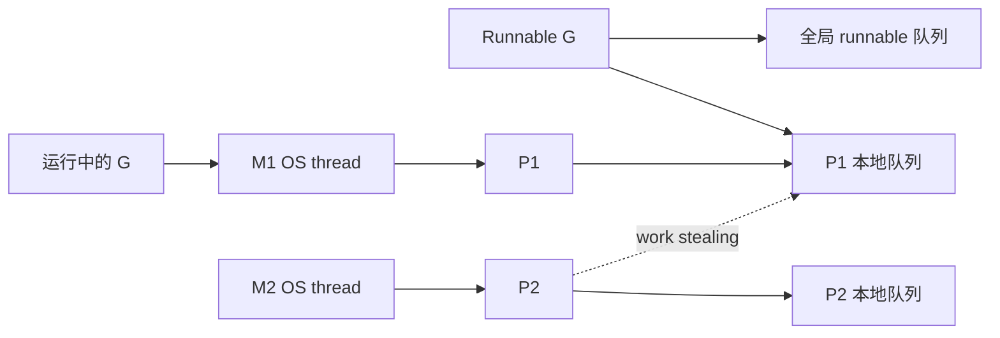

# GPM 调度器：goroutine 为什么轻量但不免费

> 记忆主线：**G 是任务，M 是 OS 线程，P 是执行上下文和本地队列；调度器负责把 runnable G 放到可运行的 M/P 上，并处理阻塞、抢占和工作窃取。**

## 一、是什么

goroutine 是由 Go runtime 管理的执行单元；线程是操作系统调度的执行单元。GPM 是理解二者关系的模型：

- `G`：goroutine 的栈、状态、执行现场；
- `M`：machine，承载 Go 代码的 OS 线程；
- `P`：processor，持有运行 Go 代码所需的资源和本地 runnable 队列。

## 二、为什么需要

- 每个请求创建 OS 线程成本高、数量受限；goroutine 让大量 I/O 并发更容易。
- 一个 G 阻塞时，M/P 可以转而运行其他 G，避免整个线程池停住。
- 本地队列降低全局锁竞争；空闲 P 可从其他 P 窃取工作，改善负载均衡。

## 三、核心用法

### 1. goroutine 只是启动，不是等待 ⭐

```go
var wg sync.WaitGroup
wg.Add(1)
go func() {
	defer wg.Done()
	work()
}()
wg.Wait()
```

启动 goroutine 后，主 goroutine 结束会让进程结束；不要用 `time.Sleep` 充当同步。

### 2. 控制并发，不要把 goroutine 当免费资源 ⭐

```go
g, ctx := errgroup.WithContext(ctx)
sem := make(chan struct{}, 16)

for _, item := range items {
	item := item
	g.Go(func() error {
		select {
		case sem <- struct{}{}:
		case <-ctx.Done():
			return ctx.Err()
		}
		defer func() { <-sem }()
		return process(ctx, item)
	})
}
return g.Wait()
```

并发度是资源约束：CPU、连接池、下游 QPS、内存、队列长度都可能是瓶颈。

### 3. 观察运行时而不是猜 ⭐

```go
fmt.Println(runtime.NumGoroutine())
fmt.Println(runtime.GOMAXPROCS(0))
```

更进一步用 goroutine profile、block/mutex profile、trace、`GODEBUG=schedtrace=...` 观察调度和阻塞。

## 四、核心原理

### 1. GPM 关系



一个 M 要绑定 P 才能执行 Go 代码；P 的数量通常受 `GOMAXPROCS` 控制，M 的数量可能因系统调用、cgo 和运行时需要而变化，不要把它们理解成固定一一对应。

### 2. 调度时机 ⭐

G 可能在这些事件被切换：

- channel、mutex、网络 I/O、系统调用等导致阻塞；
- `go` 创建新的 runnable G；
- GC、网络轮询、`runtime.Gosched` 等运行时事件；
- 长时间运行触发抢占。

Go 1.14 引入异步抢占，旧资料中“没有函数调用的死循环永远无法被抢占”的陷阱已不应当作为当前一般结论；但死循环仍然是 CPU、业务退出和数据竞态风险。

### 3. Work stealing △

当某个 P 的本地队列空了，调度器会从全局队列、网络轮询器或其他 P 获取 runnable G。窃取的目标是减少一个 P 空闲、另一个 P 堵满的情况。

### 4. 阻塞系统调用 △

执行系统调用的 M 可能阻塞，但 P 可以被 runtime 交给其他 M，让其他 G 继续运行。这个机制解释了为什么 P 不等于线程，也解释了 cgo/阻塞调用可能造成额外线程。

## 五、常见场景

- ⭐ I/O 并发：每个请求/任务一个 goroutine，但必须有超时、取消和资源上限。
- ⭐ worker pool：固定 worker 数量，队列承受短暂峰值，队列满时施加背压。
- ⭐ CPU 密集型任务：并发度围绕 `GOMAXPROCS` 和实际 benchmark 调整，不是无脑启动成千上万 G。
- △ 系统调用/cgo：观察线程数、阻塞 profile 与下游容量。
- ○ g0/user stack、scheduler 初始化汇编：源码阅读时再深入。

## 六、踩坑点

1. **goroutine 泄漏**：阻塞在无人接收的 channel、永不结束的 select、无法取消的 I/O。
2. **没有等待机制**：main/测试函数结束，goroutine 可能还没执行。
3. **依赖调度顺序**：并发输出顺序不稳定；不要用 sleep 让测试“看起来通过”。
4. **共享变量无同步**：调度器会切换，但不会自动保护内存；用 mutex、atomic 或 channel 建立同步关系。
5. **误读 `GOMAXPROCS`**：它限制同时执行 Go 代码的 P 数，不是 goroutine 数，也不严格等于 OS 线程数。
6. **异步抢占不是业务取消**：它只让出 CPU，不会结束任务、关闭连接或回滚事务。
7. **过度依赖 runtime 细节**：队列大小、字段布局、调度顺序均可能变化。

## 七、项目中的实际使用

一个可控批处理的标准约束：

```go
func RunAll(ctx context.Context, jobs []Job, n int) error {
	if n <= 0 {
		return errors.New("worker count must be positive")
	}

	q := make(chan Job)
	g, ctx := errgroup.WithContext(ctx)
	for i := 0; i < n; i++ {
		g.Go(func() error {
			for {
				select {
				case <-ctx.Done():
					return ctx.Err()
				case job, ok := <-q:
					if !ok {
						return nil
					}
					if err := runOne(ctx, job); err != nil {
						return err
					}
				}
			}
		})
	}

	g.Go(func() error {
		defer close(q)
		for _, job := range jobs {
			select {
			case q <- job:
			case <-ctx.Done():
				return ctx.Err()
			}
		}
		return nil
	})
	return g.Wait()
}
```

这里同时解决：worker 数量、生产/消费退出、首个错误取消、主流程等待。

## 八、一句话总结

**调度器让 goroutine 轻量并发成为可能，但资源上限、生命周期和共享内存的正确性仍由程序员负责。**

## 九、核心问答

### Q1：G、M、P 分别是什么？

G 是任务，M 是 OS 线程，P 是运行 Go 代码所需的上下文和 runnable 队列；M 绑定 P 后运行 G。

### Q2：goroutine 和线程是一对一吗？

不是。Go 使用 M:N 模型，许多 G 可以复用少量 M，M 的数量也会因阻塞调用和 runtime 需要变化。

### Q3：为什么 goroutine 很多仍可能 OOM？

每个 G 有栈、状态和引用；阻塞/泄漏的 G 还会保持对象存活。轻量不代表零成本。

### Q4：调度器能修复数据竞态吗？

不能。调度只改变执行时机；共享内存必须用同步原语建立 happens-before。

### Q5：为什么用 WaitGroup/errgroup 而不是 Sleep？

等待机制表达任务是否完成，能处理错误和取消；Sleep 既不保证完成，也会让测试变慢且不稳定。

## 十、自测与答案

### 题目

1. 一个 goroutine 阻塞在无缓冲 channel 发送上，为什么可能造成 goroutine 泄漏？
2. `GOMAXPROCS=1` 是否意味着程序只能有一个 goroutine？
3. 如何限制 10000 个任务最多同时执行 32 个？
4. 为什么死循环即使能被异步抢占，仍然是问题？
5. 什么时候应该使用 worker pool 而不是每个任务直接 `go`？

<details>
<summary>答案</summary>

1. 没有接收者或取消路径时，发送者会一直等待；其栈和引用仍被 runtime 保留。
2. 不是。它限制同时执行 Go 代码的 P 数，仍可创建许多 runnable/waiting goroutine。
3. 使用容量 32 的信号量，或固定 32 个 worker 消费任务队列，并配合 context 和等待。
4. 它仍可能消耗 CPU、阻止业务退出、形成数据 race 或长期占用资源；抢占只解决“不能让出 CPU”的部分。
5. 任务量大、需要背压/稳定资源占用、下游有并发上限时用 worker pool；任务少且生命周期清晰时直接 goroutine 更简单。

</details>

## 参考

- [原材料：调度器](https://golang.design/go-questions/sched/)
- [Go runtime 调度与执行追踪](https://go.dev/doc/diagnostics)
- [Go Memory Model](https://go.dev/ref/mem)
