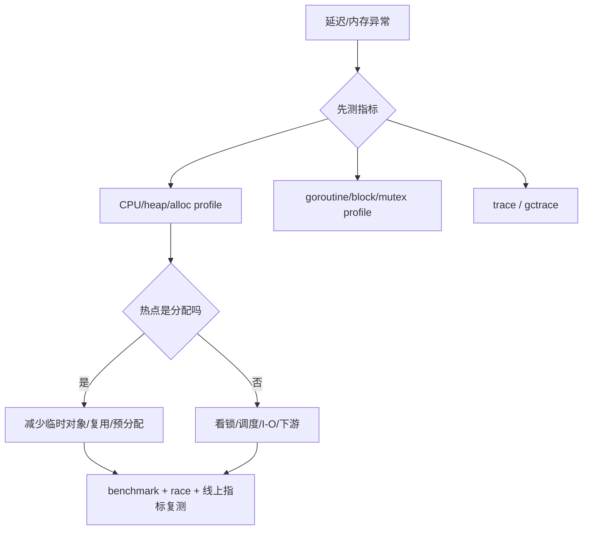

# GC、内存与性能诊断：从可达性到证据闭环

> 记忆主线：**对象是否仍可达决定能否回收；逃逸和分配影响 GC 压力；GOGC/GOMEMLIMIT 是权衡旋钮；优化必须先 profile 再改。**

## 一、是什么

Go 标准工具链使用追踪式垃圾回收：从 GC roots 出发遍历对象图，标记可达对象，回收不可达对象。常见抽象是并发标记清扫，并通过写屏障维护并发标记的正确性。

GC 管理的是 Go 内存，不等于自动管理所有资源；文件、连接、锁、goroutine、C 内存仍需确定性释放。

## 二、为什么需要

- 手动释放容易产生悬挂指针、重复释放、遗漏释放。
- 自动 GC 牺牲一部分 CPU 和内存，换取更安全的生命周期管理。
- Go 服务的真正问题通常不是“有 GC”，而是分配过快、对象活得太久、goroutine 泄漏、缓存无界或内存上限不合理。

## 三、核心用法

### 1. 先测量，再判断 ⭐

```text
go test -bench . -benchmem ./...
go test -run=^$ -bench . -cpuprofile cpu.pprof -memprofile mem.pprof ./...
go tool pprof cpu.pprof
go tool trace trace.out
go test -race ./...
```

线上可按需启用 `net/http/pprof`，同时保护访问入口；不要在没有基线的情况下直接调 GOGC。

### 2. 观察 GC 与内存 △

```text
GODEBUG=gctrace=1 ./server
GODEBUG=schedtrace=1000 ./server
```

用 `runtime/metrics`、`runtime.ReadMemStats` 或监控系统跟踪 heap、alloc、GC CPU、goroutine、RSS；指标要结合业务吞吐和延迟解释。

### 3. 控制生命周期 ⭐

```go
func BuildBatch(ctx context.Context, n int) ([]Item, error) {
	items := make([]Item, 0, n) // 预估容量，减少不必要扩容
	for i := 0; i < n; i++ {
		select {
		case <-ctx.Done():
			return nil, ctx.Err()
		default:
		}
		items = append(items, buildItem(i))
	}
	return items, nil
}
```

真正有效的 GC 优化常常是：减少无必要的分配、复用短生命周期对象、限制并发和缓存、及时断开引用；如果底层 I/O 不支持 context，外层检查并不能让阻塞的 I/O 立刻停止。

## 四、核心原理

### 1. 三色标记的直觉 △

- 白：尚未确认可达；
- 灰：已发现，但其引用尚未全部扫描；
- 黑：已扫描，引用关系已处理。

GC 从 roots 推进灰色波面，最终黑色是存活对象，仍为白色的对象可回收。用户代码并发修改对象图时，需要写屏障等机制保持不变式。

### 2. GC roots

典型 roots 包括全局变量、各 goroutine 栈、寄存器以及 runtime 维护的指针。一个对象“没有业务用途”并不代表可回收，只要仍从 root 可达，GC 就必须保留它。

### 3. GOGC 的直觉公式 ⭐

官方 GC guide 给出的目标堆大小可写成：

```text
Target heap = Live heap + (Live heap + GC roots) × GOGC / 100
```

直观含义：`GOGC` 越大，允许在下一次 GC 前分配更多内存，GC 频率和 CPU 压力通常下降，但峰值内存上升；`GOGC` 越小，内存更紧，但 GC 更频繁。

### 4. GOMEMLIMIT 是软上限 △

在受控容器中，可以通过 `GOMEMLIMIT` 或 `debug.SetMemoryLimit` 给 runtime 一个内存预算。它是软限制，不保证任何情况下都不超过；过低可能导致 GC thrashing 和严重变慢。应用还要为 runtime 不可见的 C 内存、线程栈等留余量。

### 5. 内存泄漏的 Go 版本

Go 没有手动 free，并不意味着没有泄漏：

- 全局/缓存/registry 持有本应释放的对象；
- goroutine 阻塞在永远无法完成的 channel/I/O；
- timer、ticker、回调、订阅没有解除；
- slice 子视图保留大数组；
- context/请求对象被长期存储。

## 五、常见场景

- ⭐ 高分配服务：看 alloc rate、live heap、GC CPU 和 p99，而不是只看 RSS。
- ⭐ 容器部署：设置合理 memory limit，配合 GOMEMLIMIT 留出非 Go 内存空间。
- ⭐ 峰值任务：限制并发、复用临时 buffer、避免无界队列和无界缓存。
- △ `sync.Pool`：适合可安全丢弃、短生命周期、频繁创建的临时对象；不适合业务缓存。
- ○ GC 具体阶段、mark assist、sweep 细节：只有 profile 指向 runtime 时再研究。

## 六、踩坑点

1. **手动 `runtime.GC()` 不是优化**：它会扰动正常节奏，应只用于实验或特殊控制。
2. **把 GC pause 当全部延迟来源**：锁竞争、调度、I/O、下游慢、mark assist 都可能造成延迟。
3. **只看堆大小不看存活堆**：峰值高但存活低，与真正泄漏的曲线不同。
4. **GOGC 调大不是免费提速**：可能缓解 GC CPU，却把内存压力推给容器/OS。
5. **GOMEMLIMIT 设得过低**：可能进入持续 GC，服务吞吐下降。
6. **把 finalizer 当资源释放器**：文件描述符、连接等资源应显式 Close；finalizer 时机不确定。
7. **goroutine 泄漏会带来内存泄漏**：栈、context、channel 引用都可能长期存活。
8. **对象复用不等于线程安全**：`sync.Pool` 取出对象后仍要清理状态和建立所有权。

## 七、项目中的实际使用

### 一个性能问题的诊断流程



项目建议：

1. 给关键路径写可重复 benchmark；
2. 用 `-benchmem` 看 `allocs/op` 和 `B/op`；
3. 用 pprof 定位调用栈；
4. 用 trace 观察调度、网络、GC 和阻塞时间线；
5. 只改变一个主要变量，记录版本与环境；
6. 验证业务延迟和错误率，避免只优化微基准。

## 八、一句话总结

**GC 只回收不可达的 Go 内存；性能优化要同时管理分配速率、对象生命周期、goroutine 数量和外部资源，并用 profile 证明。**

## 九、核心问答

### Q1：有 GC 为什么还会内存泄漏？

因为对象仍被 root 或长期存活对象引用，或者 goroutine 一直存活并保留其栈和引用；GC 只能回收不可达对象。

### Q2：GOGC 调大有什么代价？

通常减少 GC 频率和 CPU 压力，但提高堆峰值和内存占用；是否值得取决于资源预算和延迟目标。

### Q3：为什么不能只看 STW？

并发标记、mark assist、sweep、分配暂停、锁和调度也会影响用户请求；要看完整 profile/trace。

### Q4：什么时候适合 sync.Pool？

临时对象频繁创建、对象可被随时丢弃、复用能明显减少分配时；不能依赖 Pool 保存业务状态或保证命中。

### Q5：如何判断是 goroutine 泄漏？

看 goroutine 数随时间增长、profile 中大量相同阻塞栈、对应 channel/锁/I/O 没有退出条件，并用 context/关闭/等待修复。

## 十、自测与答案

### 题目

1. GOGC 从 100 调到 200，内存和 CPU 可能怎样变化？
2. 一个 map 缓存不断增长但 GC 很正常，为什么仍可能是内存泄漏？
3. 怎样区分“短期分配峰值”和“长期存活泄漏”？
4. 为什么 profile 发现分配热点后不能立刻加 sync.Pool？
5. 在容器中使用 GOMEMLIMIT 要留意哪些内存不在 Go heap 里？

<details>
<summary>答案</summary>

1. 通常允许更大堆后再 GC，GC CPU 可能下降，但内存峰值上升；实际需压测验证。
2. 只要 cache 仍从全局/root 可达，GC 就不会回收；这是有意或无意的长期引用。
3. 看 live heap、heap profile 随时间、引用链和 goroutine/缓存对象；峰值后 live heap 回落与持续上涨不同。
4. Pool 有清理、所有权、生命周期和复用收益前提；误用会让代码更复杂或保留脏状态。
5. C/cgo 分配、线程栈、runtime 开销、内存映射和系统库内存；要预留 headroom。

</details>

## 参考

- [原材料：垃圾回收器](https://golang.design/go-questions/memgc/)
- [A Guide to the Go Garbage Collector](https://go.dev/doc/gc-guide)
- [Go Diagnostics](https://go.dev/doc/diagnostics)
