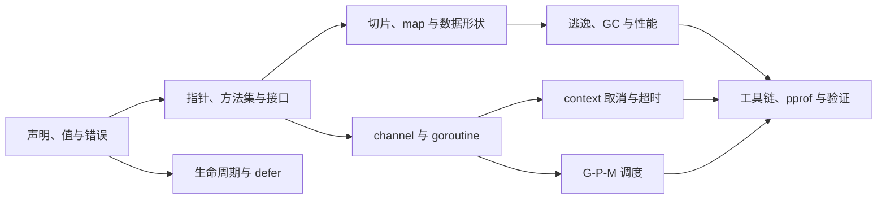

# Go 语言笔试面试题：核心主干、最小闭环与主动回忆

> 这套目录把原有 Go 语言面试题与《Go 程序员面试笔试宝典》的运行时主干合并到同一条路线。目标不是逐题背答案，而是能解释、写出、判断场景，并避开常见错误。

## 一、这套笔记怎么用

- ⭐ **必须掌握**：项目高频、后续知识依赖、面试常问；要求能解释、能写出、能判断何时使用。
- △ **理解即可**：帮助建立机制模型，能定位方向即可，暂时不要求背实现细节。
- ○ **知道存在**：低频或版本敏感内容，需要时查文档，不进入主干复习。

每篇笔记都尽量形成一个最小闭环：**是什么 → 为什么需要 → 最小写法 → 核心原理 → 场景判断 → 踩坑 → 项目流程 → 主动回忆**。

## 二、知识依赖主干

直观理解：先弄清“值如何声明和流动”，才能理解接口、数据容器和并发；再把编译器、调度器、GC 与工具链接起来，才能解释项目中的延迟、内存和 goroutine 问题。

## 三、统一目录

### 第一阶段：语言骨架与项目闭环

| 顺序 | 文档 | 主干问题 | 优先级 |
|---|---|---|---|
| 01 | [语言基础：声明、常量、错误与轻量语法](./01-语言基础-声明常量错误与轻量语法.md) | 变量如何声明？失败如何返回？哪些细节会造成遮蔽或编译错误？ | ⭐ |
| 02 | [值模型：字符串、指针、接口、方法集与逃逸](./02-值模型-字符串指针接口方法集与逃逸.md) | 一个值如何被传递、比较、放进接口、绑定方法？ | ⭐ |
| 03 | [程序生命周期：init、defer 与输出题](./03-程序生命周期-init-defer与输出题.md) | 代码什么时候执行？defer 何时求值、何时真正调用？ | ⭐ |
| 04 | [并发：channel、泄漏与 GOMAXPROCS](./04-并发-channel泄漏与GOMAXPROCS.md) | 并发任务如何通信、等待、取消并可靠退出？ | ⭐ |
| 05 | [最小项目闭环与综合复习](./05-最小项目闭环与综合复习.md) | 如何把面试知识转成项目中的标准流程？ | ⭐ |

### 第二阶段：数据容器、接口与并发工程深化

| 顺序 | 文档 | 主干问题 | 优先级 |
|---|---|---|---|
| 06 | [切片与 map：数据容器的行为边界](./06-切片与map-数据容器.md) | slice 复制了什么？append 何时改变底层数组？map 的存在性、无序性和并发边界是什么？ | ⭐ |
| 07 | [接口、方法集与反射：抽象与动态类型](./07-接口方法集与反射.md) | 类型何时满足接口？nil interface 与 typed nil 为什么不同？反射边界在哪里？ | ⭐ |
| 08 | [channel 与并发：协作、同步、退出](./08-channel与并发闭环.md) | 谁发送、谁接收、谁关闭、谁取消？如何避免阻塞和 goroutine 泄漏？ | ⭐ |
| 09 | [context：请求级取消与超时](./09-context与并发工程.md) | 如何把取消、截止时间和请求级数据沿调用链传递？ | ⭐ |

### 第三阶段：编译器、运行时与性能诊断

| 顺序 | 文档 | 主干问题 | 优先级 |
|---|---|---|---|
| 10 | [编译器、逃逸与工具链](./10-编译逃逸与工具链.md) | 如何用现代 go 命令、逃逸分析和静态检查验证判断？ | ⭐ |
| 11 | [G-P-M 调度器](./11-GPM调度器.md) | goroutine 为什么轻量但不免费？阻塞、抢占和 work stealing 如何影响执行？ | △ |
| 12 | [GC、内存与性能诊断](./12-GC内存与性能.md) | 对象如何变得可达、被标记、清扫？如何用指标和工具定位问题？ | ⭐ |
| 13 | [unsafe：只在边界处使用](./13-unsafe深水区.md) | 哪些底层技巧能解决真实边界问题，哪些只是制造未定义风险？ | △ |
| 14 | [跨章节综合问答与复习卡](./14-跨章节综合问答.md) | 能否把值模型、接口、并发、运行时和工具验证串成一次判断？ | ⭐ |

## 四、推荐学习顺序

### 第 1 轮：建立能写项目的语言骨架

先读 01–05。读完应能写出带多返回值和 `error` 的小函数，解释 `:=` 的作用域、方法集和 `defer` 时序，并设计一个能取消、能等待、不会泄漏 goroutine 的最小 worker 流程。

### 第 2 轮：补齐高频工程判断

再读 06–09。重点回答四个问题：数据结构复制了什么、接口装了什么、并发任务何时退出、请求取消如何传播。读完应能把一个 HTTP 请求中的参数、缓存、下游调用和超时串起来。

### 第 3 轮：解释性能现象

最后读 10–14。不要把运行时字段或扩容数字当作语言契约；要能提出可验证假设，并用 `go test`、`go test -race`、benchmark、`pprof`、`trace` 和 `go tool compile -m` 收口。

## 五、相似主题如何区分

| 容易混淆的主题 | 区分原则 |
|---|---|
| 02 与 07 | 02 先建立值、指针、接口和方法集的面试骨架；07 深入动态类型、反射和项目抽象边界。 |
| 04 与 08 | 04 以输出题、泄漏和 `GOMAXPROCS` 建立并发直觉；08 以关闭协议、同步关系和退出闭环处理工程问题。 |
| 02 中的逃逸与 10 | 02 只需理解“对象生命周期由编译器保证”；10 负责用工具观察逃逸、内联和构建结果。 |
| 08 与 09 | channel 负责通信和同步；context 负责取消、截止时间和请求级元数据，二者不能互相替代。 |
| 11 与 12 | 调度器回答“goroutine 何时运行”；GC 回答“对象何时仍可达、何时回收”；性能排查要结合两者。 |

## 六、版本与项目边界

- 代码按 Go Modules 和 Go 1.22 及以上的常用写法整理。
- Go 1.22 起，短变量声明的 `range` 变量按迭代生成；旧资料中的闭包陷阱不能直接套用到新模块。
- Go 1.24 起，内置 map 的运行时实现采用 Swiss Tables；旧资料中的 `hmap`、`bmap`、overflow 只能帮助理解历史实现，不能当作当前源码契约。
- `GOMAXPROCS`、调度器队列、GC 阶段和扩容系数属于实现细节；项目代码依赖规范、标准库和实测，不依赖某一版本的字段布局。
- 任何 goroutine 都要回答：谁启动、谁等待、谁发送、谁关闭、谁取消、如何退出。

## 七、统一复习检查表

- [ ] 我能解释 slice、map、interface 在函数传递时分别复制了什么、共享了什么。
- [ ] 我能区分 nil interface 与“接口中装着 nil 指针”。
- [ ] 我能写出安全的 channel 关闭和 goroutine 退出协议。
- [ ] 我能说明 context 是取消/截止时间树，而不是参数垃圾桶。
- [ ] 我能用 `go test -race`、benchmark、pprof、trace 验证性能判断。
- [ ] 我能把一次请求从值传递、接口调用、并发调度、内存分配讲到可观测性。

## 八、总入口的使用规则

以后新增 Go 面试相关内容，统一放在本目录，并在这里补一行目录和依赖位置。旧的“Go 面试主干”目录只保留兼容说明，不再新增正式笔记，避免同一知识出现两个入口。

## 九、参考资料

- [原始材料：Go 程序员面试笔试宝典](https://golang.design/go-questions/)
- [Go 语言笔试面试题汇总](https://geektutu.com/post/qa-golang.html)
- [Go Specification](https://go.dev/ref/spec)
- [Go Release History](https://go.dev/doc/devel/release)
- [Go GC Guide](https://go.dev/doc/gc-guide)
- [runtime 包文档](https://pkg.go.dev/runtime)

## 一句话总纲

**Go 面试复习要沿着“值如何流动 → 抽象如何绑定 → 并发如何退出 → 运行时如何执行 → 工具如何验证”的因果链，而不是孤立背题。**

## 总自测

1. 为什么 slice 是值传递，却可能修改调用方看到的元素？
2. 如何区分 nil interface、typed nil 和空容器？
3. 一个 worker 失败后，如何让其他 worker 取消并让主流程可靠收口？
4. 为什么看到内存增长不能直接归因于 GC，需要哪些工具验证？
5. 以后新增一篇 Go 面试笔记，你会把它放在哪个阶段，依赖哪篇已有笔记？

答案

1. slice 复制的是描述符，底层数组可能共享；修改元素通常作用于共享数组，扩容后则可能切换到新数组。
2. nil interface 没有动态类型和值；typed nil 有动态类型但动态值为 nil；空容器通常是已初始化、长度为零的具体值。
3. 用 `context.WithCancel` 或 `errgroup` 传播第一个错误，所有任务监听 `ctx.Done()`，主流程等待并返回根因。
4. 先用指标和 benchmark 确认现象，再用 heap/goroutine profile、trace、逃逸分析定位分配、引用保留或阻塞来源。
5. 先判断它依赖值模型、接口、并发还是运行时，再放入 01–05、06–09 或 10–14，并补充入口链接和主动回忆题。

